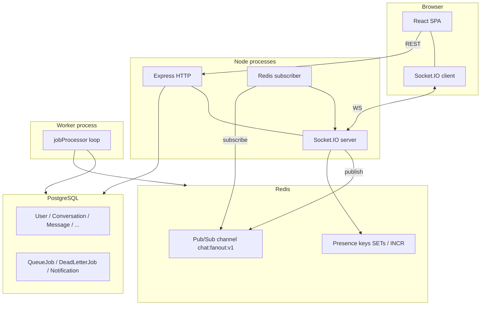
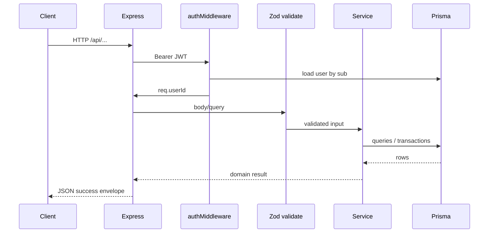
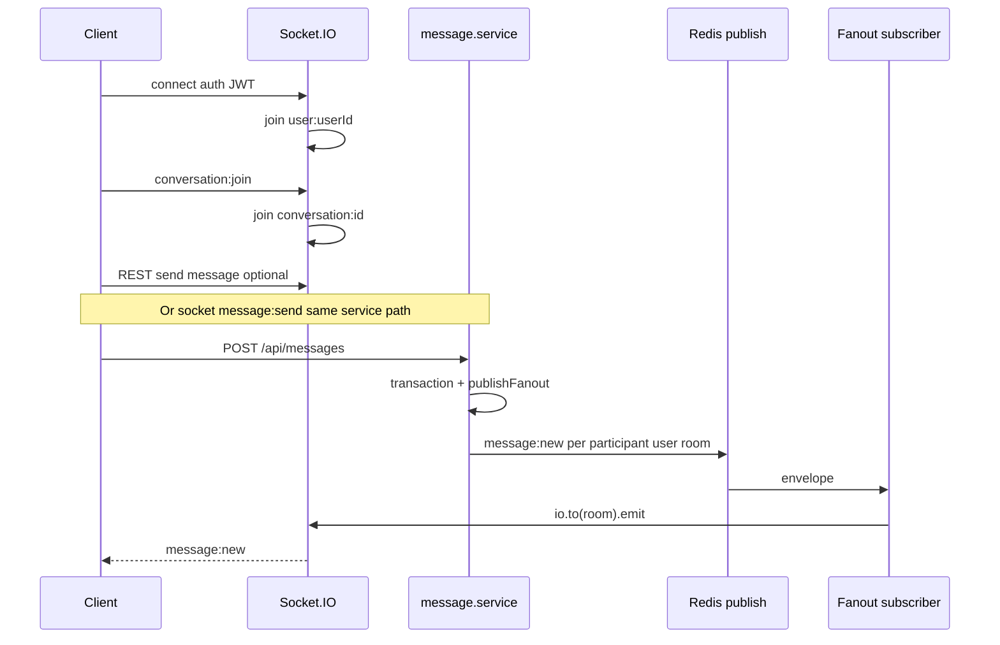
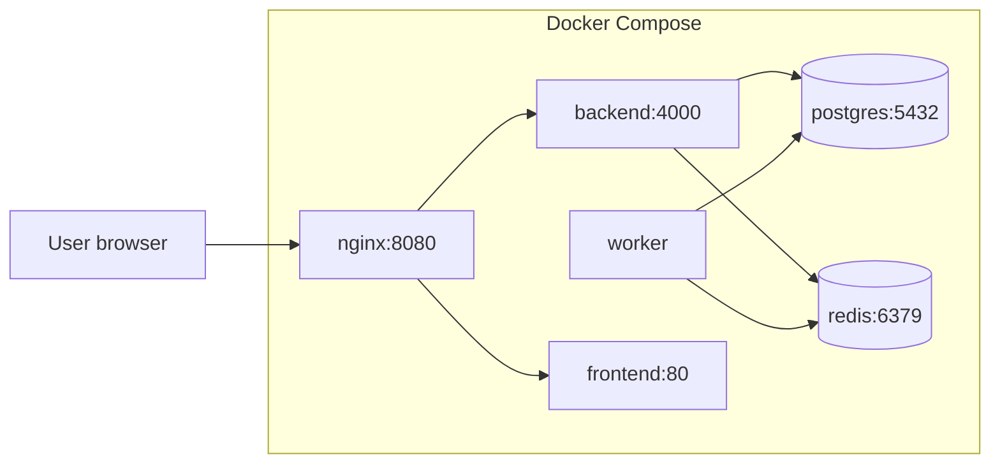

# Architecture

## Full system overview

**Relationship summary**

| Piece | Role |
|-------|------|
| **React** | Auth UI, dashboard, REST via Axios, sockets via `socket.ts` |
| **Express** | REST routes under `/api/*`, JSON body, Zod validation, JWT middleware |
| **Socket.IO** | Attached to same HTTP server in `server.ts`; shares Redis with REST |
| **PostgreSQL** | Source of truth for users, conversations, messages, notifications, jobs, DLQ |
| **Redis** | Pub/Sub fan-out channel + ephemeral presence/session keys |
| **Worker** | Separate entry `worker.ts`; polls `QueueJob`, no HTTP server |

---

## Why this architecture

| Decision | Reason |
|----------|--------|
| **Monorepo services in Compose** | Easy demo; mirrors splitting API vs worker in prod |
| **Redis Pub/Sub vs only Socket.IO Redis adapter** | Explicit envelope format; every instance runs identical subscriber code (`chatEventBus.ts`) |
| **Queue in Postgres (local)** | Zero AWS dependency for CI/demo; same job shape as SQS migration |
| **JWT** | Stateless auth for horizontal API replicas (with known cookie tradeoffs for prod) |

---

## Request / response flow (REST)

Standard envelope: `{ success: true, message: string, data: T }` from `utils/apiResponse.ts`. Errors flow through `middlewares/errorHandler.ts`.

---

## Real-time flow (conceptual)

---

## Async notification flow

1. `sendMessage` completes DB work, then `void dispatchMessageSideEffects(...)` (`notificationPipeline.service.ts`).
2. For each **other** participant: if **not** (online **and** in conversation room Redis set), create `Notification`, `emitNotificationSocket` → fan-out `notification:new` to `user:<id>`, `queue.enqueue(PROCESS_NOTIFICATION)`.
3. Worker claims job → marks notification `SENT` (or fails → retry / DLQ).

---

## Major modules (backend `src/`)

| Path | Responsibility |
|------|----------------|
| `config/env.ts` | Zod-validated environment |
| `app.ts` | Express app, middleware, route mounting |
| `server.ts` | HTTP server, Socket.IO, `attachSocketServer`, `startFanoutSubscriber` |
| `modules/auth/*` | Register, login, JWT, rate limit on auth routes |
| `modules/users/*` | Search + list users for starting chats |
| `modules/conversations/*` | Direct/group CRUD, participants |
| `modules/messages/*` | Send, list with cursor, mark delivered/read |
| `modules/notifications/*` | List/mark read, test failure enqueue |
| `modules/redis/*` | Client, subscriber duplicate, chat fan-out, presence helpers |
| `modules/socket/*` | Socket auth, room join/leave, typing, message socket handlers |
| `modules/queue/*` | Provider abstraction + local + SQS stub |
| `modules/worker/jobProcessor.ts` | Claim, process, retry, DLQ |
| `modules/ops/*` | Health, metrics, DLQ list |

---

## Modularity and scaling story

- **API replicas**: Add instances behind a TCP-aware load balancer; enable Socket.IO **Redis adapter** if you rely on in-memory rooms across hosts (this project also uses explicit Pub/Sub for envelopes—see tradeoffs doc).
- **Worker replicas**: `SKIP LOCKED` reduces double processing; tune `WORKER_POLL_INTERVAL_MS`.
- **Postgres**: Read replicas for history; primary for writes (not implemented—document as future).

---

## Architecture diagram (deployment)

This matches `docker-compose.yml` in the repository root.
