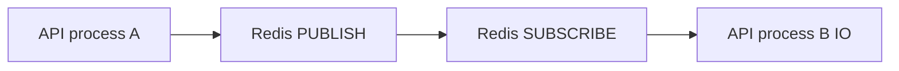

# Real-time flow (Socket.IO + Redis)

## Components

| Piece | File(s) |
|-------|---------|
| HTTP + IO server | `backend/src/server.ts` |
| Socket handlers | `backend/src/modules/socket/socket.handlers.ts` |
| Fan-out publish | `backend/src/modules/redis/chatEventBus.ts` |
| Redis client | `backend/src/modules/redis/redisClient.ts` |
| Presence helpers | `backend/src/modules/redis/presence.service.ts` |
| Message fan-out | `backend/src/modules/messages/message.service.ts` |
| Client | `frontend/src/services/socket.ts`, `frontend/src/pages/DashboardPage.tsx` |

---

## How Socket.IO is set up

`server.ts` creates `Server` from `socket.io` attached to the same `http.Server` as Express. CORS mirrors `env.CORS_ORIGIN`.

**Order of boot:**

1. `setSocketServer(io)` (registry—extension point).
2. `attachSocketServer(io)` — stores `io` in `chatEventBus` for the subscriber.
3. `registerSocketHandlers(io)` — auth middleware + connection logic.
4. `startFanoutSubscriber()` — Redis subscriber listens on `CHAT_FANOUT_CHANNEL` (`chat:fanout:v1`).

---

## Client connection and authentication

1. Browser obtains JWT (login/register).
2. **`connectSocket(token)`** passes `{ auth: { token } }` in Socket.IO client options.
3. Server **`io.use`** verifies JWT (`jsonwebtoken` + `JWT_SECRET`), loads user, attaches `userId` on socket.
4. On **`connection`**:
   - User marked online in Postgres.
   - **`addUserSession`** increments Redis key `chat:user:<id>:sessions` with TTL.
   - **`s.join(`user:${userId}`)`** — **personal inbox room** used for `message:new` and `notification:new` fan-out.
   - For each conversation membership, **`publishFanout`** `user:online` to `conversation:<id>` (so open threads see presence).

---

## Room model

| Room name | Who joins | Typical events |
|-----------|-----------|----------------|
| `user:<userId>` | On connection | `message:new` (per participant), `notification:new`, `conversation:updated` (some paths) |
| `conversation:<conversationId>` | On client `conversation:join` | `typing:*`, `message:delivered`, `message:read`, `user:online` / `user:offline` |

**Why `message:new` uses `user:<id>` rooms:**  
Clients only call `conversation:join` for the **currently open** thread. If `message:new` were **only** emitted to `conversation:*`, users focused on another chat would miss sidebar updates. The backend emits `message:new` to **each participant’s** `user:<userId>` room (see `message.service.ts`).

---

## Redis Pub/Sub fan-out

1. Any code path calls **`publishFanout({ event, room, payload })`**.
2. **`getRedis().publish(channel, JSON.stringify(envelope))`**.
3. **Every** Node process running **`startFanoutSubscriber`** receives the message.
4. Subscriber parses JSON and runs **`ioRef.to(env.room).emit(env.event, env.payload)`** — only sockets on **that** process in `room` receive the event.

This pattern lets you scale **stateless** HTTP/socket nodes horizontally without sticky-room data on a single machine’s memory being the only source of truth—**note:** you still need either sticky sessions or a **Socket.IO Redis adapter** if a single user’s reconnect lands on a different node **and** you depend on in-memory room membership without re-join; this app re-joins on conversation select.

---

## Step-by-step: first open app

1. User loads SPA, `useAuth` restores token, `GET /api/auth/me`, **`connectSocket(token)`**.
2. Socket connects, server joins **`user:<id>`**, sets online.
3. User selects conversation C; client effect registers handlers then **`emit('conversation:join', { conversationId: C })`**.
3. Server verifies membership, **`s.join(`conversation:${C}`)`**, **`joinConversationRoom`** Redis set for pipeline heuristics.

---

## Sending a message (REST path used by UI)

1. `POST /api/messages` persists message.
2. **`publishFanout`** once per **participant** to `user:<participantUserId>` with `message:new`.
3. All members’ browsers (if connected) run `onNew` handler; each updates **messages** if that convo is open, and **`loadConversations`** for list ordering/unread.

**Alternate path:** Socket event **`message:send`** exists and calls the same `messageService.sendMessage`—UI currently uses REST for send.

---

## Typing indicators

1. Client **`typing:start`** / **`typing:stop`** (no ack required).
2. Server **`publishFanout`** to **`conversation:<id>`** with payload including **`userId`** / **`senderId`** (authenticated user).
3. Recipients in that conversation room update UI; Dashboard **ignores self** by comparing ids.

---

## Presence

- **Online:** connect path sets `isOnline: true`, sessions key increment, fan-out `user:online` to conversation rooms.
- **Offline:** on disconnect, decrement sessions; if zero, set `isOnline: false` + `lastSeenAt`, fan-out `user:offline`.

**Edge case:** multiple tabs increment session count; all must disconnect before “offline.”

---

## Read / delivery

- Client calls **`PATCH /api/messages/:id/delivered`** and **`.../read`** (HTTP).
- Service updates row, then **`publishFanout`** to **`conversation:<conversationId>`** with receipt payload.
- Open clients merge into existing `messages` state.

---

## Real-time edge cases handled in code

| Scenario | Handling |
|----------|----------|
| Duplicate `message:new` | Client checks `prev.some(x => x.id === m.id)` |
| Message for non-selected conv | Still triggers `loadConversations()`; does not append to `messages` |
| Effect ordering losing events | Join + `s.on` in **one** effect; handlers registered **before** join |
| Self-typing | Client + server use authenticated user id to ignore self |
| Cross-node emit | Redis fan-out envelope |

---

## Common interview Q&A

**Q: Why not only WebSockets without Redis?**  
A single process is fine locally; Redis Pub/Sub is the minimal cross-process **message bus** so every `io` instance can emit.

**Q: Why not Server-Sent Events?**  
SSE is server→client one-way; typing and future features want **bidirectional** channels without doubling connections.

**Q: Sticky sessions?**  
Production Socket.IO behind NLB often uses TCP stickiness; this codebase still benefits from Redis fan-out when HTTP handlers on instance A publish events consumed on instance B.
